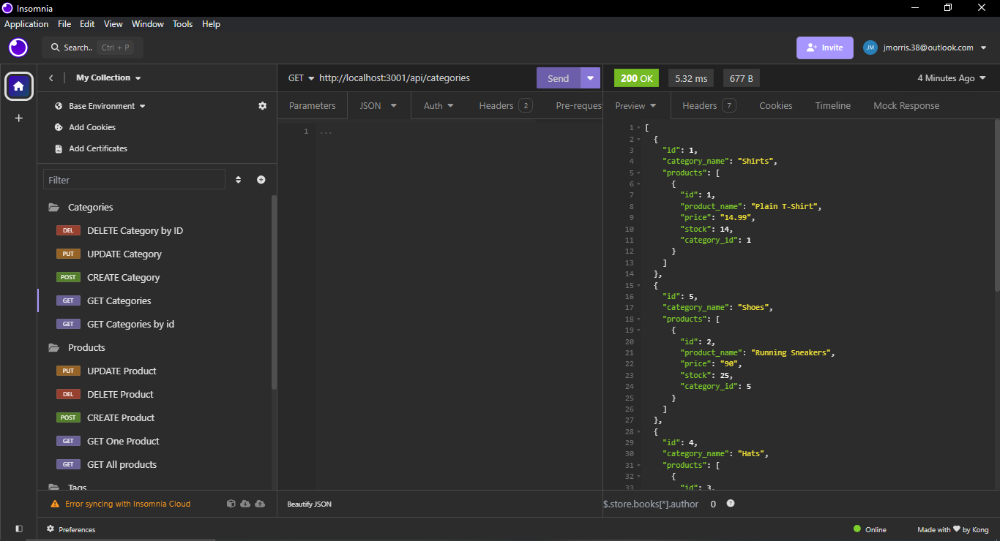
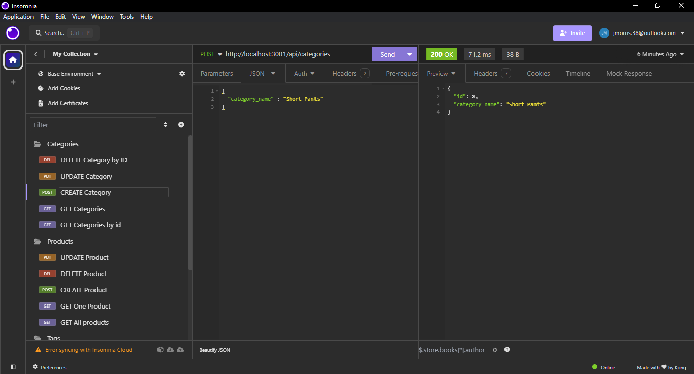
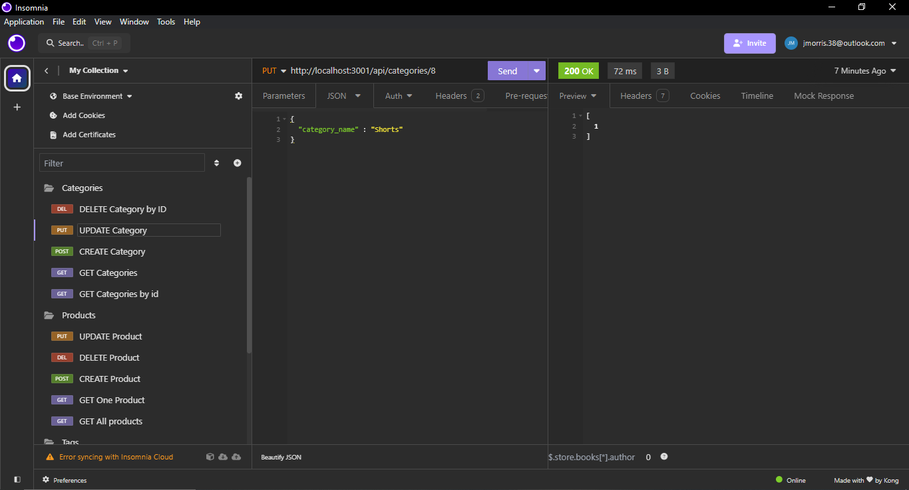

# Module-13-Challenge-E-commerce-Website-ORM-Back-End
E-commerce Back End based on ORM

## Description
This is the E-commerce Back End for an e-commerce site based on Express.js API and configured with Sequelize to interact with a PostgreSQL database.

## User Story
AS A manager at an internet retail company
 
I WANT a back end for my e-commerce website that uses the latest technologies
 
SO THAT my company can compete with other e-commerce companies

## WalkThrough Video
[Video link]()

## Installation

 Install the following:
  
 npm install express
  
 npm install sequelize, pg, dotenv

 ## Prerequisites
 PgAdmin 4, PostgresSQL 15, Insomnia Core

 ## Preview
 

 

 

 ## License

 

 This project is licensed under the [MIT License](https://choosealicense.com/licenses/mit/) license.

 ## Contributing

 Pull requests are most welcome

 ## Queries

 GitHub: https://github.com/jmorris38

 Email: jmorris38@outlook.com

